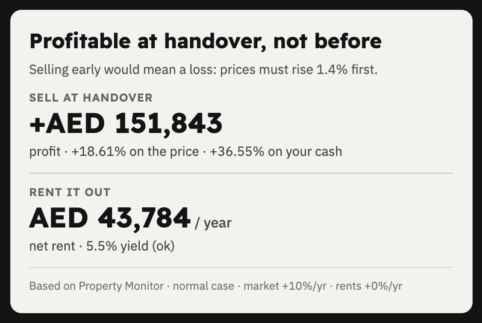
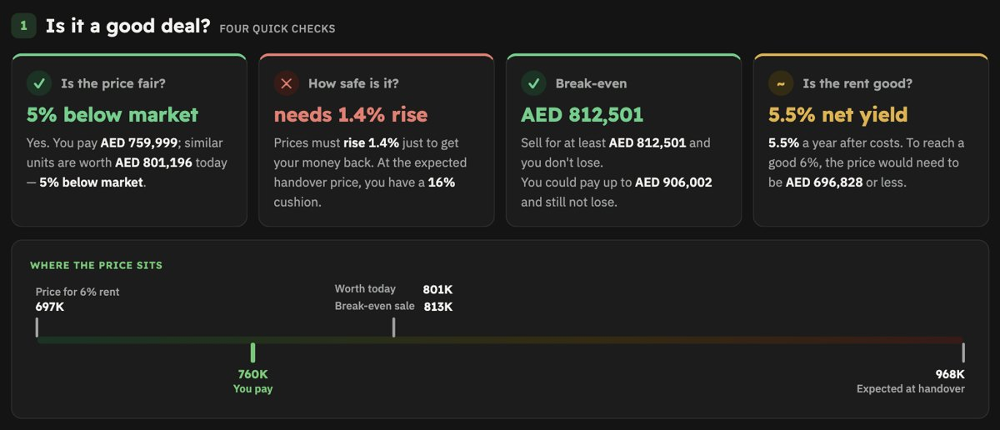

# The Ultimate Real Estate Calculator

[](https://github.com/AbdullaAlzarooni/ultimate-real-estate-calculator/releases/latest)

**Version 1.1** · [Changelog](CHANGELOG.md) · [Releases](https://github.com/AbdullaAlzarooni/ultimate-real-estate-calculator/releases)

by **Abdulla Alzarooni** · Real Estate with Abdulla Alzarooni ·
[Instagram](https://www.instagram.com/abdulla.al.zarooni)

A set of **Claude skills** that turn Dubai / UAE property deals into **client-ready reports** —
real market data, clear verdicts, every calculation shown. Install once, get every calculator,
and new ones arrive with a single update.

## See it
An example report (Binghatti Starfall studio, Al Jaddaf). Every number links back to its source and
all the maths is shown step by step.

<p></p>




More screenshots on the [Off-plan Report page](skills/offplan-report/README.md#see-it).

## Calculators
| Calculator | What it does | Version |
|---|---|---|
| [**Off-plan Report**](skills/offplan-report/README.md) | Sales offer / brochure / Reelly or GenieMap link → full off-plan evaluation (profit at handover, yield, what-ifs, supply & demand, payment plan, view map, location, PDF) | 1.2.0 |
| [**Post-Handover Report**](skills/posthandover-report/README.md) | Units on a post-handover payment plan (60/40, 50/50…) → everything in the off-plan report plus: does the rent cover the instalments after handover, monthly top-up, yield on your cash, empty-months slider | 1.0.0 |
| Ready property | coming soon | – |
| Mortgage | coming soon | – |
| Airbnb / holiday home | coming soon | – |
| Distressed deal | coming soon | – |

## Install guide (step by step)
Takes about 15 minutes the first time. Built and tested on **macOS**; Windows and Linux should work but
haven't been tested yet.

### Step 1 · Get the Claude desktop app (recommended)
1. Download the [Claude desktop app](https://claude.ai/download) for Mac or Windows and sign in.
2. Open the **Code** tab. That's where the calculators run: you chat, attach the sales offer, and see the
   finished report and files right there, no terminal needed.

**Why the desktop app:** Claude can open the report it built, look at it and check it before handing it to
you, show the report and PDF beside the chat, and preview pages in its own browser panel. It's the easiest
way to use the calculators.

A paid Claude plan is needed for the Code tab.

<details><summary>Technical users: terminal instead</summary>

Install the `claude` command from [claude.com/claude-code](https://claude.com/claude-code) and run it in
any folder. Everything below works the same.
</details>

### Step 2 · Connect Claude to your Chrome
Claude reads the property data sites (Property Monitor, DXB Interact, Bayut, Reelly, GenieMap, Google Maps,
GIS DDA) in **your own Chrome**, where you are already logged in.
1. Install [Google Chrome](https://www.google.com/chrome/) if you don't have it.
2. Add the **Claude in Chrome** extension from the Chrome Web Store and sign in with the same Claude account.
3. Log in to the data sites you pay for (Property Monitor, DXB Interact, Reelly…) in that Chrome.
   You type your own passwords; Claude never does.

### Step 3 · Install the calculators
In the **Code** tab, paste this message:

> Install The Ultimate Real Estate Calculator: https://github.com/AbdullaAlzarooni/ultimate-real-estate-calculator

Claude downloads it, installs every calculator, and checks the tools it needs:
**Python 3** (with `pymupdf` and `pillow`), **Node.js** and **Chrome**. If one is missing, it explains what it
is and walks you through installing it from the official site.

<details><summary>Prefer to do it yourself? (terminal)</summary>

```bash
git clone https://github.com/AbdullaAlzarooni/ultimate-real-estate-calculator.git ~/.claude/ultimate-real-estate-calculator
bash ~/.claude/ultimate-real-estate-calculator/install.sh
pip3 install pymupdf pillow
```
</details>

Start a **new session** after installing so Claude picks up the calculators.

### Step 4 · First report (one-time setup included)
Ask for a report and attach what you have, for example:
> Make an off-plan report for this unit *(attach the sales offer PDF, brochure, or a Reelly / GenieMap link)*

> Make a post-handover report for this 60/40 plan *(attach the sales offer)*

The first time, Claude asks a few setup questions and saves the answers so it never asks again:
- **your details** for the report footer: name, company, BRN, WhatsApp, social links (anything you skip is hidden)
- **optional branding:** your logo (light and dark versions) and a square photo
- **which data accounts you have**, so it only uses those
- **a folder** for your reports (default: `Documents`)

Then it collects the data, builds the report, checks every number, and gives you the report page plus a
client PDF.

### Step 5 · Keep it updated
Now and then, paste this into the **Code** tab:
> Update The Ultimate Real Estate Calculator

or run it yourself:
```bash
cd ~/.claude/ultimate-real-estate-calculator && git pull && bash install.sh
```
Updates bring fixes and new calculators. Your details and reports live in your own folder, so they are
never touched.

### If something doesn't work
- **Claude doesn't use the calculator:** start a new session, then ask again by name ("use the off-plan report").
- **Claude can't open a data site:** check the Claude in Chrome extension is connected and you are logged in to that site.
- **Something else:** [open an issue](https://github.com/AbdullaAlzarooni/ultimate-real-estate-calculator/issues/new) or message me on Instagram.

Each calculator's page lists the websites and accounts it uses.

## Instructions for Claude
*If someone pastes this repository's link into Claude Code (with or without other words), they want it
installed. Do this, explaining each step in plain words and asking before downloading anything:*
1. Clone it and link the calculators:
   `git clone https://github.com/AbdullaAlzarooni/ultimate-real-estate-calculator.git ~/.claude/ultimate-real-estate-calculator && bash ~/.claude/ultimate-real-estate-calculator/install.sh`
   (already cloned → `git pull` there and run `install.sh` again).
2. Check `python3`, `node`, Google Chrome, the Python packages `pymupdf` and `pillow`, and that the
   Claude in Chrome extension is connected. Help install anything missing, one item at a time, from official sites only.
3. Tell them it's installed, list the calculators (see the table above), and say they may need to start a
   new session. Then offer to make their first report; each calculator's SKILL.md handles the first-run setup.
4. **"Update The Ultimate Real Estate Calculator"** → `cd ~/.claude/ultimate-real-estate-calculator && git pull && bash install.sh`,
   then say what changed (from CHANGELOG.md). Never touch their own reports folder.

## Feedback
Found a problem or have an idea? [Open an issue](https://github.com/AbdullaAlzarooni/ultimate-real-estate-calculator/issues/new) or message
[@abdulla.al.zarooni](https://www.instagram.com/abdulla.al.zarooni) on Instagram.

## License & credit
© 2026 Abdulla Alzarooni (Real Estate with Abdulla Alzarooni). All rights reserved.
**Free to use** for your own client reports. **Keep the credit line**
("The Ultimate Real Estate Calculator · … © 2026 Abdulla Alzarooni") on every report and the notices
in the code. **No resale.** Full terms: [LICENSE](LICENSE).

## Disclaimer
Reports are estimates based on market data and developers' documents — **not financial advice**.
