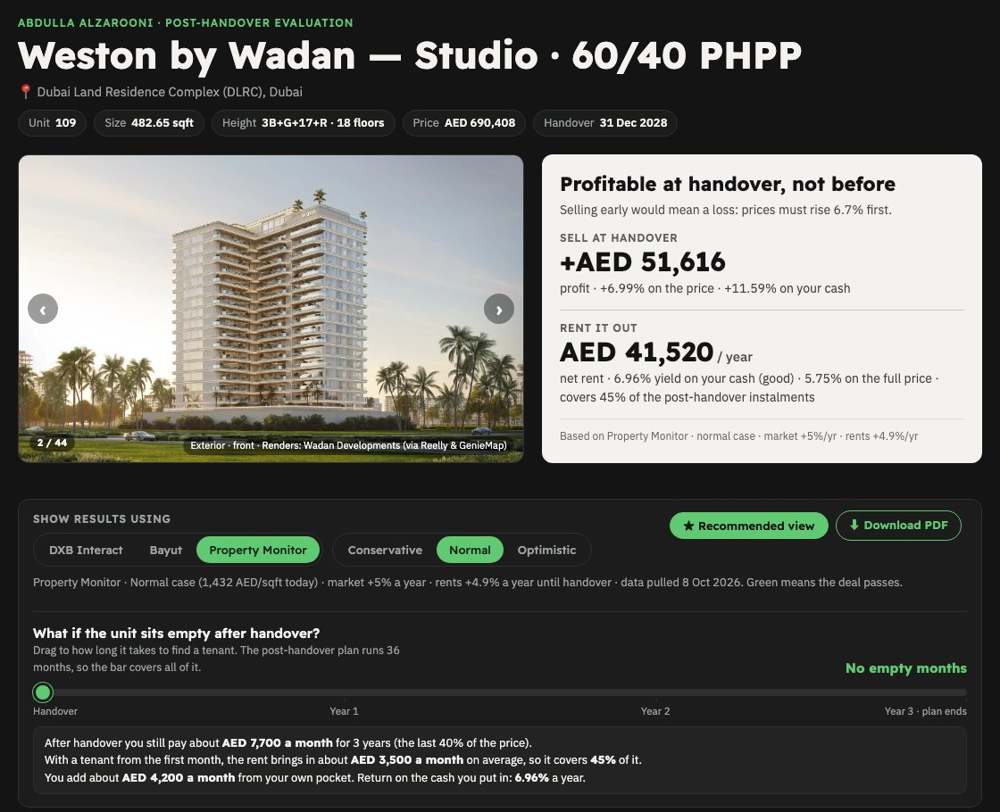
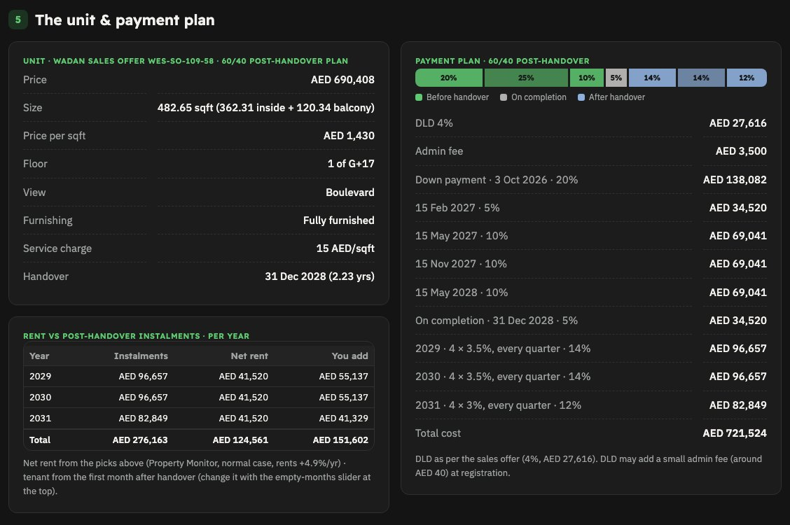
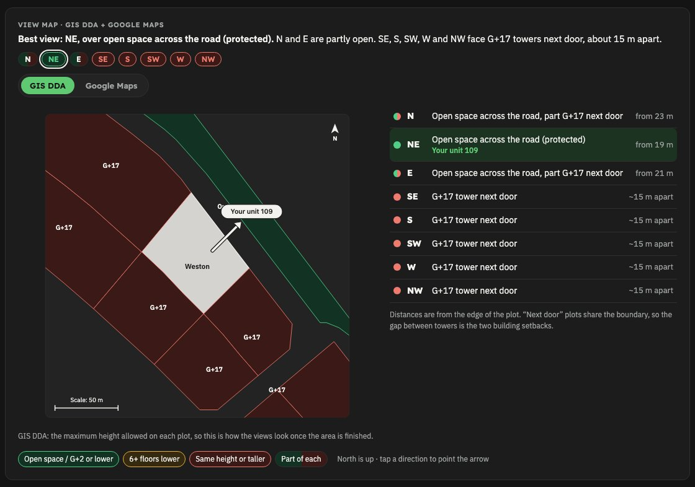

# Post-Handover Report

[](CHANGELOG.md)

Part of **[The Ultimate Real Estate Calculator](../../README.md)**.

**Version 1.0.0** · [Changelog](CHANGELOG.md) · Version history: [all versions](https://github.com/AbdullaAlzarooni/ultimate-real-estate-calculator/tags) · [collection releases](https://github.com/AbdullaAlzarooni/ultimate-real-estate-calculator/releases) · by **Abdulla Alzarooni** (Real Estate with Abdulla Alzarooni)

For units sold on a **post-handover payment plan** (60/40, 50/50 and similar): you keep paying after
handover, so the real questions are **does the rent cover those instalments, how much do I add each
month, and what do I earn on the cash I actually put in?** Give Claude the **sales offer** (or a brochure /
project link) and it builds a client-ready report (web page + PDF) that answers them, on top of everything
in the [Off-plan Report](../offplan-report/README.md).

---

## See it
Example: Weston by Wadan studio 109, DLRC, on Wadan's 60/40 plan.

**Verdict and the empty-months slider:** profit if you sell at handover, rent and yield on your cash, and
what happens if the unit sits empty after handover



**Payment plan and rent vs instalments:** every payment before and after handover, and what the rent covers each year



**View map:** what each side of the building faces (GIS DDA allowed heights + Google Maps)



---

## What you get
Everything in the Off-plan Report, plus:
- **"Does the rent cover the plan?"**: % of the post-handover instalments the rent pays, and your monthly top-up
- **Yield on your cash**: rent compared with the money you actually put in (rent collected during the plan reduces it)
- **Rent vs instalments per year** table and a payment timeline with an "after handover" segment
- **Empty-months slider**: drag to how long it takes to find a tenant; the report explains the effect in plain words
- **Plan cost**: how much more the post-handover plan costs than the standard plan, and what that is per year
- **Sell at handover** valuation (the buyer takes over the remaining plan)

---

## Quick start
Install once (see the [install guide](../../README.md#install-guide-step-by-step)); one install gives you every
calculator. Then, in the Claude desktop app's **Code** tab, attach the sales offer and say:
> Make a post-handover report for this unit

The first time, Claude asks for your details and which data accounts you have; they are saved.
If you already use the Off-plan Report, it reuses your details.

---

## Websites it uses
The same as the [Off-plan Report](../offplan-report/README.md#websites-it-uses). The **sales offer must show
the full payment plan**, including every instalment after handover.

---

## How it works (for the curious)
- `SKILL.md` — the instructions Claude follows
- `references/` — step-by-step workflow, websites, formulas (post-handover maths at the end of `rules.md`),
  design decisions, every data field
- `kit/` — `build.py`, `template/report-template.html` (layout + all formulas), `data/example-weston-109-ph.js`
  (a complete real example), `tools/` (checks, GIS DDA and view-map tools)

Try the example yourself:
```bash
cd ~/.claude/ultimate-real-estate-calculator/skills/posthandover-report/kit
python3 build.py data/example-weston-109-ph.js
node tools/dump.js example-weston-109-ph.html
node tools/sheetcheck-ph.js example-weston-109-ph.html
```
The first check renders every scenario combination and must print `bad 0 []`; the second compares the
numbers with the author's Post-Handover Property Evaluation Form (difference ≈ 0; the sheet adds an AED 40
DLD admin fee). The example's photos aren't included; the page works without them.

---

## License & credit
© 2026 Abdulla Alzarooni (Real Estate with Abdulla Alzarooni). All rights reserved.

**Free to use** for your own client reports. **Keep the "The Ultimate Real Estate Calculator ©" credit line** on every
report and the notices in the code. **No resale** or passing it off as your own.
Full terms: [LICENSE](../../LICENSE). Commercial use or removing the credit:
contact [@abdulla.al.zarooni](https://www.instagram.com/abdulla.al.zarooni) on Instagram.

## Disclaimer
Reports are estimates based on market data and the developer's documents — **not financial advice**.
Check each data site's terms of use. Icons: Font Awesome Free brand shapes (CC BY 4.0).

## Feedback
Found a problem? [Open an issue](https://github.com/AbdullaAlzarooni/ultimate-real-estate-calculator/issues/new) or message [@abdulla.al.zarooni](https://www.instagram.com/abdulla.al.zarooni) on Instagram.
